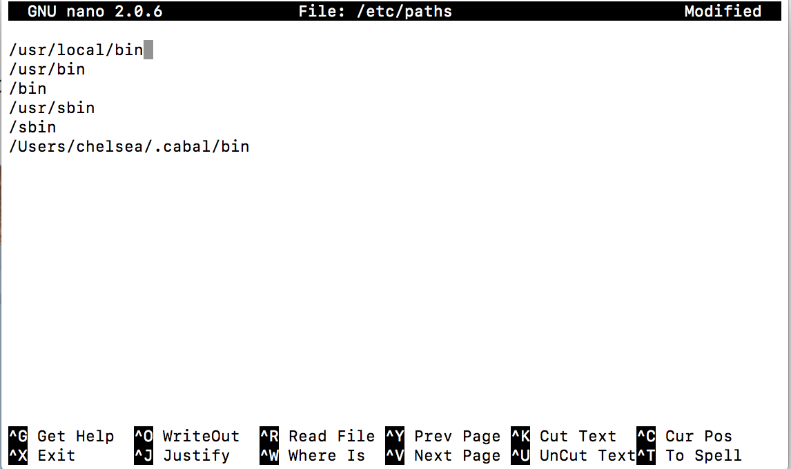

# Q: how to install Doctest by using cabal in Mac OS X

## 1. Install haskell platform
  - Go to website https://www.haskell.org/platform/ 
  - Follow the instruction to install haskell platform

## 2. update the list of package in hackage
  - Open your terminal
  - Using command: `cabal update`
  - Stay in terminal

## 3. install doctest package
  - using command: `cabal install doctest`

#### You may think everything is done.. No! :joy: 
#### You should add the installation directory into you PATH, or you will get a error said "-bash: doctest: command not found"
  
## 4.find installation directory of doctest
  - when you choose the installer of Haskell platform 
    - if you choose core installer, 
      - your installation directory might be in:  ~/.cabal/bin
    - if you choose full installer,
      - your installation firectory might be in:  ~/Library/Haskell/bin
     
  - The way that I used to find installation directory is:
    using command line step by step 
    - `cd .cabal`
    - `cd bin`
    - `ls`     -- you will see the doctest is in your directory
    - `pwd`    -- print working directory
    -  copy the path
    
 ## 5.add your installation directory into your PATH permanently
   - Run the following command step by step
     - `sudo nano /etc/paths`
     - type you password if promoted
     - Paste the path we copy in step 4 into the bottom of file
     file should be look like this: 
     
     - hit control x to quit
     - enter y
     
  ## 6.Congradulation! 
    - Now you can use doctest to test your program by typing command line:
      - `doctest example.hs` (be sure you are in same directory with example.hs)

    
    
   
